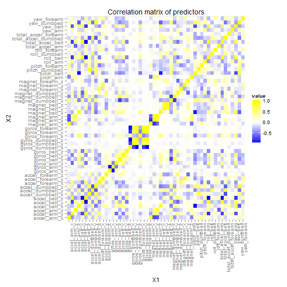

Use of a Simple Random Forest Model in classification of Dumbell Exercises
========================================================

# Summary
In this assignment we try to predict the performance of dumbell exercises, from data comming from weareble devices, based on the experiments of [groupware@LES](http://groupware.les.inf.puc-rio.br/har). We made simple cleaning of the data based on removing labels and variables with large ammount of missing data. Because we found that many variables were highly correlated, we concluded that we could use use PCA to reduce the ammount of predictors. Finaly, we used 24 principal components to train a random forest modelusing 10-fold cross validation. The resulting model reported a 97.34% accuracy on a test set, with highest accuracy (99.08%) for classification of class A excercise and lowest accuracy (96.08%) for class C

# Data Import and Preprocessing

We will select a clasification method for data from accelerometers on the belt, forearm, arm, and dumbell of 6 participants that perform wheight lifting exercises. More details of the experiment can be accessed on the website from [groupware@LES](http://groupware.les.inf.puc-rio.br/har).

First we will get the training data from the internet

```r
setInternet2(TRUE)
download.file(url = "https://d396qusza40orc.cloudfront.net/predmachlearn/pml-training.csv", 
    destfile = "train.csv")
```


```r
library(data.table)
data <- fread("train.csv")
```


From quick inspection we notice that the first seven variables are labels, therefore we can skip them.


```r
data[, `:=`(names(data)[1:7], NULL), with = F]
```


We transform columns to numeric (except outcome), since some columns have been read as character


```r
outcome <- as.factor(data[, classe])
data <- data[, lapply(.SD, as.numeric), .SDcols = -153]
data[, `:=`(classe, outcome)]
```


We drop all columns that are form by more than 70% NA


```r
to.drop <- data[, sapply(.SD, function(x) sum(is.na(x)))]
to.drop <- to.drop > 0.7 * (nrow(data))
data[, `:=`(names(data)[to.drop], NULL), with = F]
```


We have reduced the set to:

```r
dim(data)
```

```
## [1] 19622    53
```


We will check if the outcome is balanced

```r
summary(data[, classe])
```

```
##    A    B    C    D    E 
## 5580 3797 3422 3216 3607
```

We have similar ammounts of samples for each class, therefore we don't have to spend effort in downsampling the classes and we can procede in the normal way.

Now we separate the data in training and test set

```r
library(caret)
```

```
## Loading required package: lattice
## Loading required package: ggplot2
```

```r
set.seed(1234)
train.index <- createDataPartition(y = data[, classe], p = 0.6, list = T)
training <- data[train.index[[1]], ]
testing <- data[-train.index[[1]], ]
```


We have 52 predictors. Next we will check how correlated are these variables


```r
M <- (cor(training[, .SD, .SDcols = -53]))
library(ggplot2)
library(reshape)
M.m <- melt(M)
ggplot(M.m, aes(X1, X2, fill = value)) + geom_tile() + scale_fill_gradient2(low = "blue", 
    high = "yellow") + ggtitle("Correlation matrix of predictors") + theme(axis.text.x = element_text(angle = 90, 
    hjust = 1))
```

 


In the plot we can see several areas with high colors, which means, variables with high correlation. This let us to think that we could benefit from principal component analysis to reduce the number of predictors.

We use caret to generate new uncorrelated predictors. And use principal components that explain at least 95% of the variance on the data
 

```r
preProc <- preProcess(training[, .SD, .SDcols = -53], method = "pca", thresh = 0.95)
preProc
```

```
## 
## Call:
## preProcess.default(x = training[, .SD, .SDcols = -53], method =
##  "pca", thresh = 0.95)
## 
## Created from 11776 samples and 52 variables
## Pre-processing: principal component signal extraction, scaled, centered 
## 
## PCA needed 24 components to capture 95 percent of the variance
```


From the info of the pre processing object we notice that we need only 24 variables to explain the variability of the data. We will use this pre procesing to train our model later 

# Model Fitting

We will try fititng a random forest model to classify our data. We chose random forest for two main reasons: random forest perform very well in classification, and they already "include" cross validation.

In random forest, each three is constructed using a bootstrap sample of the training data. To calculate the missclasification rates in the training set, each sample is pased only on the trees that did not use it for train.Therefore, the reported error should be already a good approximation of the error in a test set. More info can be read [here](http://www.stat.berkeley.edu/~breiman/RandomForests/cc_home.htm) 

However, for this assignment we will simply use k-folds cross validation with small number of folds since the machine we use has very low computation power

Now we train our random forest model. We will use the principal components pre procesing object derived from last section.

```r
set.seed(999)
trainPC <- predict(preProc, training[, .SD, .SDcols = -53])
fitControl <- trainControl(method = "cv", number = 10)
modelFit <- train(training[, classe] ~ ., method = "rf", data = trainPC, proximity = F, 
    trControl = fitControl)
```

```
## Warning: package 'randomForest' was built under R version 3.1.1
## Warning: package 'e1071' was built under R version 3.1.1
```

```r
modelFit
```

```
## Random Forest 
## 
## 11776 samples
##    23 predictors
##     5 classes: 'A', 'B', 'C', 'D', 'E' 
## 
## No pre-processing
## Resampling: Cross-Validated (10 fold) 
## 
## Summary of sample sizes: 10599, 10598, 10598, 10599, 10599, 10598, ... 
## 
## Resampling results across tuning parameters:
## 
##   mtry  Accuracy  Kappa  Accuracy SD  Kappa SD
##   2     1         1      0.004        0.005   
##   10    1         1      0.005        0.006   
##   20    1         0.9    0.007        0.009   
## 
## Accuracy was used to select the optimal model using  the largest value.
## The final value used for the model was mtry = 2.
```


The best model reports an out of sample accuracy of 100% for a model with mtry=2
Now we will check the confusion matrix on the trining set


```r
confusionMatrix(training[, classe], predict(modelFit, trainPC))
```

```
## Confusion Matrix and Statistics
## 
##           Reference
## Prediction    A    B    C    D    E
##          A 3348    0    0    0    0
##          B    0 2279    0    0    0
##          C    0    0 2054    0    0
##          D    0    0    0 1930    0
##          E    0    0    0    0 2165
## 
## Overall Statistics
##                                 
##                Accuracy : 1     
##                  95% CI : (1, 1)
##     No Information Rate : 0.284 
##     P-Value [Acc > NIR] : <2e-16
##                                 
##                   Kappa : 1     
##  Mcnemar's Test P-Value : NA    
## 
## Statistics by Class:
## 
##                      Class: A Class: B Class: C Class: D Class: E
## Sensitivity             1.000    1.000    1.000    1.000    1.000
## Specificity             1.000    1.000    1.000    1.000    1.000
## Pos Pred Value          1.000    1.000    1.000    1.000    1.000
## Neg Pred Value          1.000    1.000    1.000    1.000    1.000
## Prevalence              0.284    0.194    0.174    0.164    0.184
## Detection Rate          0.284    0.194    0.174    0.164    0.184
## Detection Prevalence    0.284    0.194    0.174    0.164    0.184
## Balanced Accuracy       1.000    1.000    1.000    1.000    1.000
```


The model is able to classify correctly all the data in the training set, which might be caused by overfitting.

Most importantly is chscking the accuracy in our test set because our model is not biased for that data. Again, we must first use the same pre procesing that we use for the training set and then we can predict using the modelFit model:


```r
testPC <- predict(preProc, testing[, .SD, .SDcols = -53])
confusionMatrix(testing[, classe], predict(modelFit, testPC))
```

```
## Confusion Matrix and Statistics
## 
##           Reference
## Prediction    A    B    C    D    E
##          A 2214    3    6    9    0
##          B   26 1465   25    0    2
##          C    2   26 1324   16    0
##          D    6    0   56 1221    3
##          E    0    6   15    8 1413
## 
## Overall Statistics
##                                        
##                Accuracy : 0.973        
##                  95% CI : (0.97, 0.977)
##     No Information Rate : 0.287        
##     P-Value [Acc > NIR] : <2e-16       
##                                        
##                   Kappa : 0.966        
##  Mcnemar's Test P-Value : NA           
## 
## Statistics by Class:
## 
##                      Class: A Class: B Class: C Class: D Class: E
## Sensitivity             0.985    0.977    0.928    0.974    0.996
## Specificity             0.997    0.992    0.993    0.990    0.995
## Pos Pred Value          0.992    0.965    0.968    0.949    0.980
## Neg Pred Value          0.994    0.994    0.984    0.995    0.999
## Prevalence              0.287    0.191    0.182    0.160    0.181
## Detection Rate          0.282    0.187    0.169    0.156    0.180
## Detection Prevalence    0.284    0.193    0.174    0.164    0.184
## Balanced Accuracy       0.991    0.984    0.961    0.982    0.996
```


For the test set we get an accuracy of 97.3% which we consider as acceptable. We can also examine the indivifual classes and notice that most of the errors come from class D, which means that is the most difficult class to identify.

# Conclusion

We used data comming from wearable devices, registring different acceleration quantities when the user performs dumbell excercises. First, we performed data cleaning. From the original 106 columns we were able to reduce the data to 52 predictors and one outcome variable by simple inspection. We performed correlation analysis and notice that a large ammount of variables have large correlation and concluded that the modelling could benefit from using principal component analysis in order to reduce the size of the data. We fitted a random forest model to predict the outcome variable using 24 principal components as predictors. Since the computer we used for this work is not particularly powerfull we limited our cross validation to a 10-fold cross validation. We came up with a model that has an 97% accuracy on a test data set.
